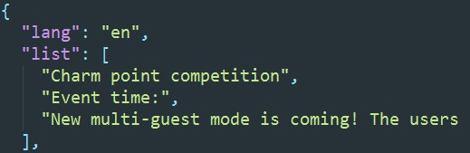
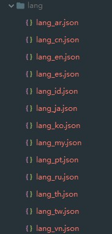
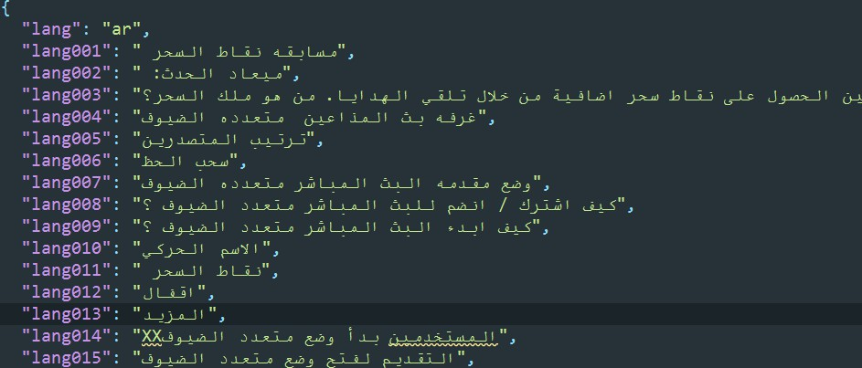

# excel to json

> 现在很多企业开始做国外的项目，比如国外的直播等等，涉及到多语言，我司是通过 前端拿到浏览器的请求国家标识然后映射成对应的语言码，然后根据格局不同的语言码去请求不要的语言文件，从而实现的多语言。
>> 不知道有没有更好的多语言加载方法？

> 在做web多语言开发时，经常需要手动去做一些复制多国语言的事情，很容易出错，比如阿拉伯语等等.所写了个脚本来做这个事情。

> 本着能脚本 不手动的想法，所以就写了一个webpack插件。

### npm install excel2json-bigo --save-dev
#### 脚本：
```
// 之前想着把插件放在webpack中，但是这个东西又不是必要每次都要输出，
// 所以把它单独 领出来当作一个脚本。
new excel2json({
   jsonDir: path.join(__dirname, './lang'),
   excelPath: path.join(__dirname, './dev/files/lang.xlsx'),
   fileName: 'lang_[key].[json]',
   staticPath: '/live/lang/'
})
```


- jsonDir output的文件夹。
- excelPath entry excel 的文件路径。
- fileName 输出文件的名称  `[key]`=>excel中的不同文件标识。`[json]`=>输出的文件类型
****
> excel 表现数据的形式有限，目前只能转化普通键值对和数组
>> **==>** 

### entry :
> 

### output:
> 
  


